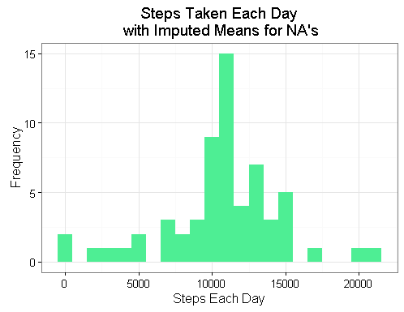

```{r setup, include=FALSE}
knitr::opts_chunk$set(echo = TRUE)
```

## Introduction

This document presents the step by step analyis of data from a personal activity monitoring device. This device collects data at 5 minute intervals through out the day. The data consists of two months of data from an anonymous individual collected during the months of October and November, 2012 and include the number of steps taken in 5 minute intervals each day.  

The dataset is available on the course web site (https://d396qusza40orc.cloudfront.net/repdata%2Fdata%2Factivity.zip). Expanding the compressed file yields a comma-separated-value (CSV) file, Activity.csv. Activity.csv has 17,568 records with the following variables.
 
Variable |Description 
--- | ---------------------------------------------------------------|  
steps| Number of steps taking in a 5-minute interval (missing values are coded as NA)|
date| The date on which the measurement was taken in YYYY-MM-DD format|
interval| Identifier for the 5-minute interval in which measurement was taken|

### Files
`PeerAssignment1.R` contains code to load and analyze the activity dataset and present results.  `getData.R` is used by `PeerAssignment1.R` to load data.  All code, markdown and report files are stored at https://github.com/wer61537/RepData_PeerAssessment1.  **Note**: It is assumed that Activity.csv is in the user's current working directory.


## Prepare the R environment

The `knitr` libray is loaded. **echo = TRUE** so that others can read the code. 

```r
library(knitr)
opts_chunk$set(echo = TRUE, results = 'hold')
```

### Load required libraries and helper functions
Libaries and helper functions are loaded.  `The getData`

```r
library(data.table)
library(ggplot2) 
source("getData.R")
```


## Loading and preprocessing the data

### Load the required data

A helper function, `getData` is used to load the data.   using `read.csv()`.
**Note**: It is assumed that Activity.csv is in the current working directory.

```r
df.activity<-getData()
```

```r
getData <- function(){
  
  #  vars for files
  fileName <- "repdata-data-activity.zip"
  datafile <-"activity.csv"
  
  # download file if necessary
  if(! file.exists(fileName)) {
    message(paste("Downloading ", fileName ," ..."))
    fileURL="https://d396qusza40orc.cloudfront.net/repdata%2Fdata%2Factivity.zip"
    download.file(url=fileURL,destfile=fileName)
  }
  
  # extract if needed
  if(! file.exists(datafile)) {
    message(paste("Extracting ", filename, " from the zip file ..."))
    unzip(zipfile=fileName)
  }
  else {
    message("Data file already extracted ...")
  }
  
  # file is csv 
   message("Loading actvity data for October and November in 2012 ...")
  df <- read.csv (datafile,
                            header = TRUE,
                            sep = ","
                           )

  message("Returning a data frame ...")
return (df)
}
```
Verify a dataframe was loaded with data.  Exit if it has not been.

```r
#verify dataframe is populated
if(!length(df.activity[1,]) > 0L){
  message("Empty dataset so exiting script ....")
  Stop
}
```


###Preprocess the data

Cast the  **date** variable (`char` class) to a `Date` class.  For the first analysis,   **interval** variable is cast as a `Factor` class. **Note**: For the last portion of the assignment the interval class is cast as numeric to faciliated plotting.


```r
df.activity$date <- as.Date(df.activity$date, format = "%Y-%m-%d")
df.activity$interval <- as.factor(df.activity$interval)
```

Peek at the created data frame with `str()`, `head()` and `tail()` methods to verify data.

```r
str(df.activity)
head(df.activity)
tail(df.activity)
```

```

'data.frame':	17568 obs. of  3 variables:
 $ steps   : int  NA NA NA NA NA NA NA NA NA NA ...
 $ date    : Date, format: "2012-10-01" "2012-10-01" "2012-10-01" ...
 $ interval: Factor w/ 288 levels "0","5","10","15",..: 1 2 3 4 5 6 7 8 9 10 ...

  steps       date interval
1    NA 2012-10-01        0
2    NA 2012-10-01        5
3    NA 2012-10-01       10
4    NA 2012-10-01       15
5    NA 2012-10-01       20
6    NA 2012-10-01       25

      steps       date interval
17563    NA 2012-11-30     2330
17564    NA 2012-11-30     2335
17565    NA 2012-11-30     2340
17566    NA 2012-11-30     2345
17567    NA 2012-11-30     2350
17568    NA 2012-11-30     2355
```

## What is mean total number of steps taken per day?

For this section missing values will be ignored. The variable ***steps*** is aggregated (summed) by date and stored in a new dataframe, `df.dailysteps`, with two variables: date and steps.  

```r
df.dailysteps <- aggregate(
                    steps ~ date, 
                    df.activity, 
                    sum
                    )
```
Peek at the dataframe with steps aggregated by day.

```r
head(df.dailysteps)
```

```
        date steps
1 2012-10-02   126
2 2012-10-03 11352
3 2012-10-04 12116
4 2012-10-05 13294
5 2012-10-06 15420
6 2012-10-07 11015
```

To get a sense of the distribution of the steps by day, a histogram is plotted.  ***Note:*** `print(p)` seems to necessary to reliably present the image of the graph.


```r
p<-ggplot(df.dailysteps, aes(x = steps)) + 
  geom_histogram(binwidth = 1000,fill="seagreen2") + 
  labs(title="Steps Taken Each Day", 
       x = "Steps Each Day", y = "Frequency") + theme_bw()
print(p)
```

 

The ***mean*** and ***median*** of the number of steps each day is then calculated. day.


```r
meanDailySteps   <- mean(df.dailysteps$steps, na.rm=TRUE)
medianDailySteps <- median(df.dailysteps$steps, na.rm=TRUE)
```
Mean |Median 
--- | ---|  
10,766.19| 10,765|

For activity data with missing data removed, the mean number of daily steps is **10,766.19** while the median number of daily steps is **10,765**.

## What is the average daily activity pattern?

We calculate the aggregation of steps by 5-minute intervals in a data frame called `df.intervalsteps`.  The dataframe has two variables: interval, avgsteps.  The `interval` variable is cast as an integer.  


```r
df.intervalsteps <- aggregate(
                      df.activity$steps, 
                      by = list(interval = df.activity$interval),
                      FUN=mean, na.rm=TRUE
                      )
#convert to integers for ggplotting
df.intervalsteps$interval <- 
  as.integer(levels(df.intervalsteps$interval)[df.intervalsteps$interval])
colnames(df.intervalsteps) <- c("interval", "avgsteps")
head(df.intervalsteps)
```
Peek at the dataframe with the average steps by interval.

```r
head(df.intervalsteps)
```

```
  interval  avgsteps
1        0 1.7169811
2        5 0.3396226
3       10 0.1320755
4       15 0.1509434
5       20 0.0754717
6       25 2.0943396
```

A scatter plot of average steps (averaged across all days) per interval is created.

```r
p<-ggplot(df.intervalsteps, aes(x=interval, y=avgsteps)) +   
  geom_line(size=1 ) +  
  labs(title="All Days Average Number of Steps \nby Interval", x="Interval", y="Interval Step Average\n") +  
  theme_bw()
print(p)
```

 

The interval with the maximum average number of steps is located.

```r
intervalMax <- df.intervalsteps[which.max(df.intervalsteps$avgsteps),]
print(intervalMax)
```

The maximum number of steps is **206** which occurs at interval **835**. 


## Imputing missing values:

### Total number of missing values:

The total number of missing values in steps is calculated using `is.na()` function to check whether a steps value is mising or not.  The resulting logical vector is summed giving the number of intervals missing steps.


```r
missing.count<- sum(is.na(df.activity$steps))
```

There are **2,304**  ***missing values*** .

### Strategy for filling in all of the missing values in the dataset

Missing values will be replaced with the average value of the same interval across all the days in the dataset. The starting dataframe, `df.activity` is grouped by the `interval` variable.  Any missing `steps` values aree replaced with that interval's overall average.  A new dataframe, `df.imputed`, is created.

After a successful check for missing values in `df.imputed`, `steps` values are aggregated by the `date` variable. The result is stored as a dataframe, `df.dailystepsImp`.


```r
df.imputed <- df.activity %>%
  group_by(interval) %>%
  mutate(steps = ifelse(is.na(steps), mean(steps, na.rm=TRUE), steps))

#str(df.imputed)

#check for missing values
if(sum(is.na(df.imputed$steps))!=0){
  message("Some missing values still exist.")
  Stop
}
#aggregate steps by date
df.dailystepsImp <- aggregate(
  steps ~ date, 
  df.imputed, 
  sum
  )
str(df.dailystepsImp)
```
Peek at the aggregated steps by day for the dataframe (`df.dailystepsImp`) with missing values replaced by the mean.

```r
head(df.dailystepsImp)
```

```
        date    steps
1 2012-10-01 10766.19
2 2012-10-02   126.00
3 2012-10-03 11352.00
4 2012-10-04 12116.00
5 2012-10-05 13294.00
6 2012-10-06 15420.00
```


### A histogram of the total number of steps taken each day

As before, to get a sense of the distribution of the steps by day for the imputed data, a histogram is plotted.  ***Note:*** `print(p)` seems to necessary to reliably present the image of the graph.


```r
#plot 
p<-ggplot(df.dailystepsImp, aes(x = steps)) + 
  geom_histogram(binwidth = 1000,fill="seagreen2") + 
  labs(title="Steps Taken Each Day\n with Imputed Means for NA's", 
       x = "Steps Each Day", y = "Frequency") + theme_bw()
print(p)
```

 

### Calculate and report the **mean** and **median** total number of steps taken per day.

As before, the mean and median values for the average daily steps is calculated.

```r
stepsImp.mean   <- mean(df.dailystepsImp$steps, na.rm=TRUE)
stepsImp.median <- median(df.dailystepsImp$steps, na.rm=TRUE)

steps.mean   <- mean(df.dailysteps$steps, na.rm=TRUE)
steps.median <- median(df.dailysteps$steps, na.rm=TRUE)
#compare
summary(df.dailysteps$steps)
summary(df.dailystepsImp$steps)
sd(df.dailysteps$steps, na.rm=T)
sd(df.dailystepsImp$steps, na.rm=T)

```

```
> summary(df.dailysteps$steps)
   Min. 1st Qu.  Median    Mean 3rd Qu.    Max. 
     41    8841   10760   10770   13290   21190 
> summary(df.dailystepsImp$steps)
   Min. 1st Qu.  Median    Mean 3rd Qu.    Max. 
     41    9819   10770   10770   12810   21190 
> sd(df.dailysteps$steps, na.rm=T)
[1] 4269.18
> sd(df.dailystepsImp$steps, na.rm=T)
[1] 3974.391
```

### Do these values differ from the estimates from the first part of the assignment?

Statistic|Missing Values Excluded|Missing Values Replaced| 
--- | ---|---|  
Median|10,765|10,766.19 |
Mean|10,766.19|10,766.19|

Excluding missing values the mean and median were  **107,66.19 ** and  **10,765**.  After replacing the missing values with imputed values the mean and median were both **10,766.19**.

### What is the impact of imputing missing data on the estimates of the total daily number of steps?

Substituting average steps for missing values shifts the first and third quartiles closer to the mean and median. Similarly, the standard deviation values show that the spread is data for the imputed recordset has decreased from 4269.18 to 3974.39.  

## Are there differences in activity patterns between weekdays and weekends?

Starting with the dataframe with imputed values for the missing steps(`df.imputed`). The interval variable is recast as numeric to facilitate plotting.  A new factor variable (`day`) with two levels (weekend and weekday) is created.  The average of steps by interval and day (weekend or weekday) is calculated.  Finally, a scatter plot of the average steps by interval at both levels (weekend and weekday).  


```r
#convert interval back to numeric for plotting
df.imputed$interval =as.numeric(df.imputed$interval)
df.imputed$day <- ifelse(as.POSIXlt(as.Date(df.imputed$date))$wday%%6 == 
                                  0, "Weekend", "Weekday")
df.imputed$day <- factor(df.imputed$day, levels = c("Weekday", "Weekend"))
#calc steps by interval and day
df.intervalstepsImp <- aggregate(steps ~ interval + day, df.imputed, mean)
head(df.intervalstepsImp)
```

Following a plot comparing the average number of steps by 5-minute interval on weekdays and on weekends.

```r
p<-ggplot(df.intervalstepsImp, aes(x=interval, y=steps, color= day)) + 
  geom_line(color="seagreen2") + 
  facet_wrap(~ day, nrow=2, ncol=1) +
  labs(x="Interval", y="Average Steps\n") +
  theme_bw()

p<-p+ggtitle("Average Steps by Interval \n by Weekday/Weekend\n for Imputed Data")
print(p)
```

 

There are some interesting differences between weekday and weekend activity.  

##### Weekday Activity

Interval|Time|Steps|
--- |---|---|  
76|6 AM|77|
104|8 AM|230|
146|12 PM|173|
190|3 PM|96|
213|5 PM|83|
227|6 PM|101|

##### Weekday Activity

Interval|Time|Steps|
--- |---|---|  
112|9 AM|167|
126|10 AM|95|
148|12 PM|142|
160|1 PM|112|
198|4 PM|145|
220|6 PM|93|
244|8 PM|87|

During the week, activity begins at interval 69 (5 am) with a global maximum of 230 steps at interval 104 (8 AM).  Other, smaller peaks, are at intervals.  Clearly, the most activity is in the morning.  During weekend, there is activity earlier than interval 112 (9 AM) but the major peaks are at interval 148 (12 PM).  Other lesser peaks in actvity occur at intervals and times shown in the tables. Finally, the major peak in weekday activity is at interval 104 (8 AM) had 230 steps.  No weekend peak activity is that large.

